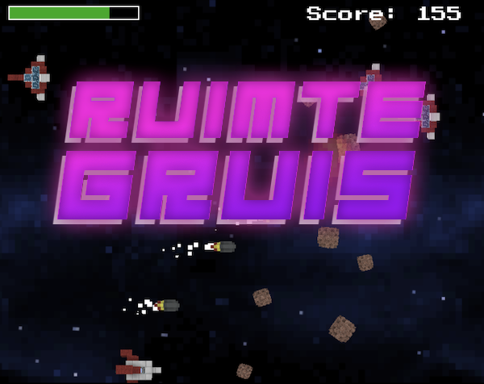

# Ruimtegruis

A space shooter built in [Phaser 3](https://phaser.io/phaser3) with [Typescript](https://www.typescriptlang.org) and [Parcel](https://parceljs.org) 🤯

## [Play the game!](https://kokodoko.github.io/ruimtegruis/)



## Preparing

```sh
# Install tools
sudo npm install -g typescript
sudo npm install -g parcel-bundler

# start project
npm install
npm run start

# build project
npm run build
```

## Typescript Classes

Create `Scene` classes as the main screens of the game. A `Scene` contains sprites, groups, text and graphics. The `init`, `preload`, `create` and `update` methods are all called automatically by Phaser.

```typescript
export class GameScene extends Phaser.Scene {

    private score:number = 0
    private field:Phaser.GameObjects.Text

    constructor() {
        super({key: "GameScene"})
    }

    public init(): void {
    }
    
    public preload(): void {
    }
    
    public create(): void {
        this.add.image(0, 0, 'background')
        this.field = this.add.text(400, 150, 'Score: 0', { fontFamily: 'Arial', fontSize: 40, color: '#FFF' })
    }

    public update(): void {
        this.field = "Score : " + this.score
    }
}

```
Here we create a physics sprite and add the sprite to the physics simulation. Now we can use physics methods such as `setVelocity()`. Add the sprite to the scene by using `let rock = new Rock(this)` in a scene.

```typescript
export class Rock extends Phaser.Physics.Arcade.Sprite {

    public score:number = 5

    constructor(scene: Phaser.Scene) {
        super(scene, 20, 30, "rock")       
        this.scene.add.existing(this) 
        this.scene.physics.add.existing(this) 
        this.setVelocity(20, 0)
    }

    private resetPosition() {
        this.x = 1100
        this.y = Phaser.Math.Between(50, 550)
    }

    public update() {
        if (this.x < -300 || this.x > 1400 || this.y < -300 || this.y > 900){
            this.resetPosition()
        }
    }
}
```
The `update` method gets called automatically when the sprite is part of a group in the parent scene. If not, you have to call `update` manually from the parent scene.

## Workshop

Check the [HR-CMGT workshop]() to learn more about using Phaser with Typescript.

## Phaser documentation

Note that the official docs are in Javascript, which may need some small adjustments to work in a Typescript project.

- [Phaser 3 Examples](http://labs.phaser.io) - A great source for exploring. Click **EDIT** to see the source code 🤩!
- [Phaser 3 Documentation](https://photonstorm.github.io/phaser3-docs/index.html)
- [Getting started with Phaser 3](https://phaser.io/tutorials/getting-started-phaser3)
- [Phaser 3 Coding Tips](https://phaser.io/learn/community-tutorials)

## Inspiration

- [Phaser games built in Typescript by digitsensitive](https://github.com/digitsensitive/phaser3-typescript/)
- [Parcel settings for Phaser](https://github.com/samme/phaser-parcel)